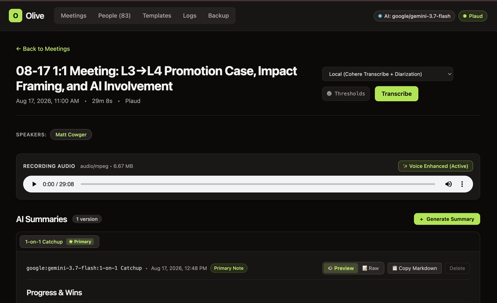
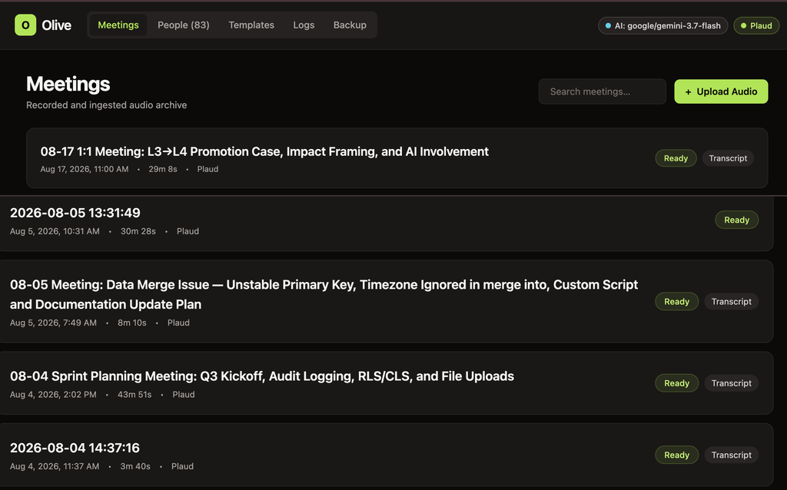
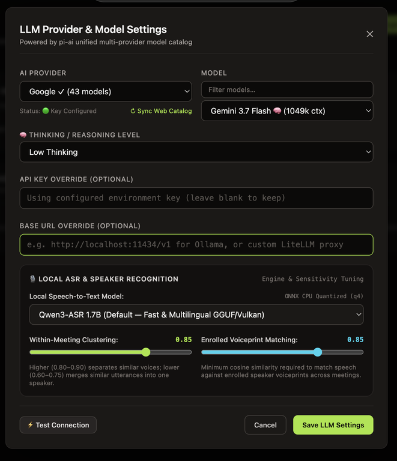
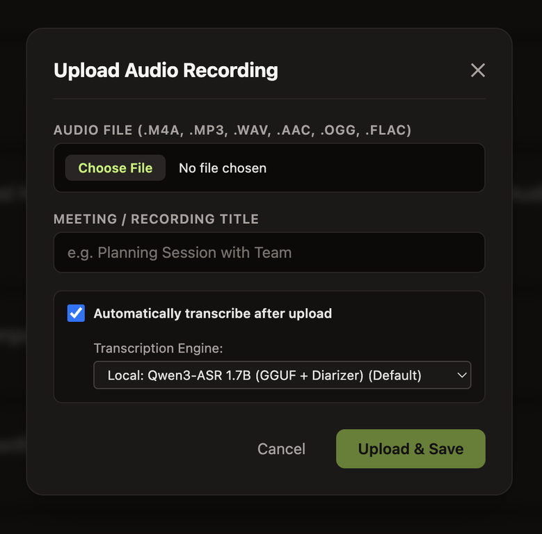
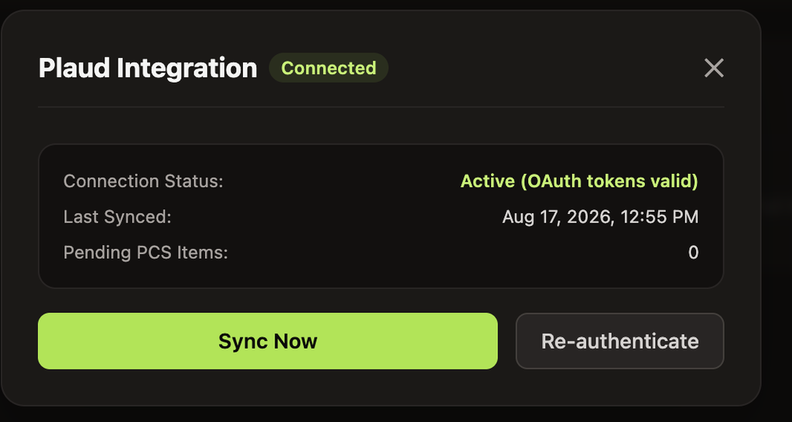
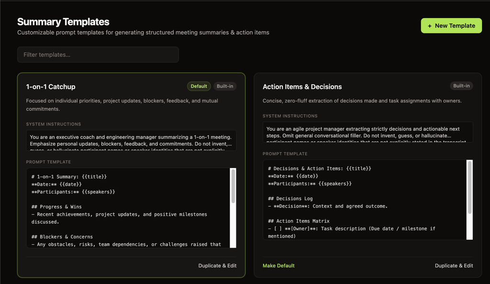
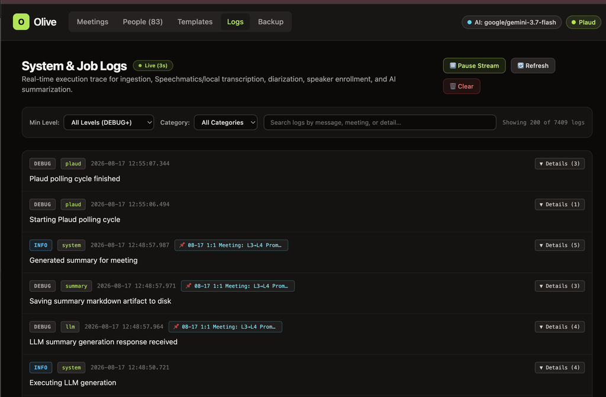
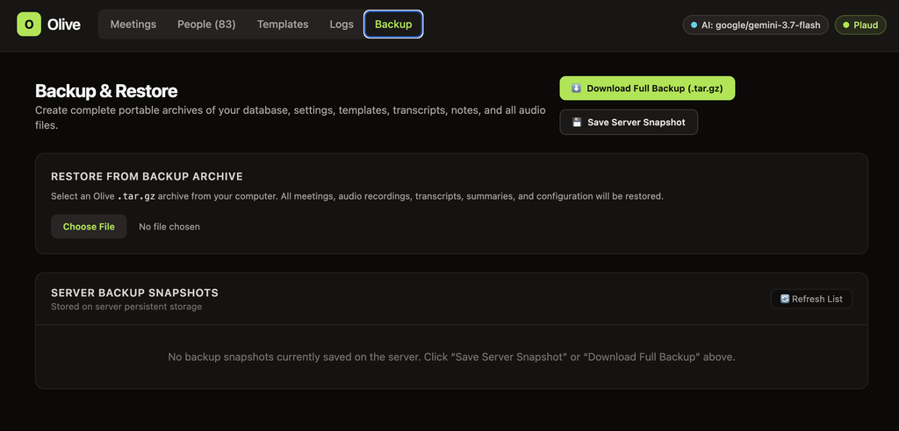

<div align="center">

# 🫒 Olive

**Self-Hosted AI Meeting Intelligence, Speaker Diarization & Audio Archive**

A private, self-hosted system that ingests audio from hardware voice recorders, mobile voice memos, and browser uploads — automatically transcribing, diarizing with neural speaker identification, and generating structured AI summaries with customizable templates.

[](https://bun.sh)
[](https://www.typescriptlang.org/)
[](https://react.dev/)
[](https://tailwindcss.com/)
[](https://sqlite.org/)
[](https://github.com/k2-fsa/sherpa-onnx)
[](https://huggingface.co/ggml-org/Qwen3-ASR-1.7B-GGUF)
[](https://docker.com)

<br/>



</div>

---

## ✨ Features at a Glance

| Feature | Description |
| :--- | :--- |
| 🎙️ **Multi-Source Audio Ingestion** | Upload `.m4a`, `.mp3`, `.wav`, `.aac`, `.ogg`, `.flac`, `.webm` with automatic SHA-256 deduplication and instant transcription. |
| 📲 **Plaud Note Integration** | Native OAuth 2.0 PKCE sync with official Plaud Cloud — automatically fetches recordings, transcripts, and AI notes. |
| 📱 **Apple Voice Memos Shortcut** | One-tap iOS Share-Sheet shortcut to send recordings directly to your Olive instance from iPhone or iPad. |
| 🧠 **Dual Transcription Pipeline** | Choose between fast **Local Neural STT** (Qwen3-ASR 1.7B GGUF / ONNX / Cohere / Granite) or cloud **Speechmatics**. |
| 👤 **Neural Speaker Diarization** | Local Sherpa-ONNX 3D-Speaker / ECAPA-TDNN neural embeddings for cross-meeting voiceprint matching and speaker recognition. |
| 🤖 **Multi-Provider LLM Summaries** | Powered by `pi-ai` model catalog. Connect to Google Gemini, Anthropic Claude, OpenAI, Ollama, LM Studio, or custom proxies. |
| 📝 **Customizable Summary Templates** | Parameterized prompt templates (`1-on-1 Catchup`, `Action Items & Decisions`, `Sprint Retrospective`) with live Markdown previews. |
| 📊 **Real-Time System & Job Logs** | Live 3-second streaming log viewer with category filters, severity levels (`DEBUG+` to `ERROR`), and structured payload inspection. |
| 💾 **Complete Backup & Disaster Recovery** | Single-click `.tar.gz` export and restore containing database snapshots, configurations, prompt templates, and all audio files. |

---

## 📸 Application Showcase

### Meeting Archive & Detail View
Review audio recordings with interactive seekbars, voice enhancement indicators, speaker identification, and multi-version AI summaries with raw markdown copy & preview.

<div align="center">
  
  <p><em>Meetings Archive Dashboard with instant search, duration metadata, and source tags.</em></p>
</div>

<br/>

<div align="center">
  
  <p><em>Detailed Meeting View featuring HTML5 audio player, speaker pills, and rendered Markdown AI summaries.</em></p>
</div>

---

### LLM Provider & Neural ASR Settings
Switch between cloud and local AI providers on the fly with granular control over reasoning levels and diarization clustering sensitivities.

<div align="center">
  
  <p><em>Unified model catalog, thinking / reasoning level configuration, and diarization sensitivity sliders.</em></p>
</div>

---

### Ingestion & Hardware Integration
Easily upload local audio files or connect Plaud hardware devices via automated OAuth token sync.

<div align="center">
  <table>
    <tr>
      <td width="50%" align="center">
        
        <br/>
        <em>Direct audio file upload with auto-transcribe toggle and engine picker.</em>
      </td>
      <td width="50%" align="center">
        
        <br/>
        <em>Plaud Cloud OAuth 2.0 integration with automatic recording & PCS sync.</em>
      </td>
    </tr>
  </table>
</div>

---

### Customizable Summary Templates
Define structured summary formats tailored to specific meeting workflows (1-on-1s, Standups, Executive Briefs, Technical Architecture Reviews).

<div align="center">
  
  <p><em>Customizable prompt templates with variable interpolation (<code>{{title}}</code>, <code>{{date}}</code>, <code>{{speakers}}</code>, <code>{{transcript}}</code>).</em></p>
</div>

---

### Real-Time Observability & System Logs
Monitor ingestion queues, diarization steps, model inference latency, and Plaud polling in real time with live streaming logs.

<div align="center">
  
  <p><em>Live 3s streaming log console with category filters and structured execution metadata.</em></p>
</div>

---

### Full Backup & Disaster Recovery
Export and restore database snapshots, settings, templates, transcripts, notes, and raw audio files in a single self-contained archive.

<div align="center">
  
  <p><em>One-click full system backup export and archive restore manager.</em></p>
</div>

---

## 🏗️ Architecture

```
SOURCES                           PIPELINE & ARTIFACT STORE                       INTELLIGENCE & EXPORT
───────                           ─────────────────────────                       ─────────────────────

 [ Plaud Note AI ] ──(OAuth/PCS)─┐
                                 │      ┌─────────────────────────────┐
 [ iOS Shortcut ]  ──(Ingest)───┼────► │   Meeting Aggregate Root    │
                                 │      │  ─────────────────────────  │
 [ Web UI Upload ] ──(Upload)───┘      │  • sha256 deduplicated      │
                                        │  • audio/<id>.<ext>         │
                                        │  • SQLite metadata + WAL    │
                                        └──────────────┬──────────────┘
                                                       │
                                 ┌─────────────────────┴─────────────────────┐
                                 ▼                                           ▼
                    ┌─────────────────────────┐                 ┌─────────────────────────┐
                    │     Transcription &     │                 │   LLM Summarization &   │
                    │   Speaker Diarization   │                 │    Action Item Engine   │
                    │ ─────────────────────── │                 │ ─────────────────────── │
                    │ • Local: Qwen3-ASR 1.7B │                 │ • pi-ai Unified Catalog │
                    │ • Sherpa-ONNX 3D-Spkr   │                 │ • Gemini / Claude / GPT │
                    │ • Cloud: Speechmatics   │                 │ • Local Ollama / vLLM   │
                    │ • Voiceprint Enrollment │                 │ • Structured Templates  │
                    └─────────────────────────┘                 └─────────────────────────┘
                                 │                                           │
                                 └─────────────────────┬─────────────────────┘
                                                       │
                                                       ▼
                                        ┌─────────────────────────────┐
                                        │     Interactive Web App     │
                                        │  Markdown • Audio • Backup  │
                                        └─────────────────────────────┘
```

---

## 🚀 Quickstart

### Prerequisites
- [Bun](https://bun.sh) (v1.4+)
- `ffmpeg` (for local audio decoding)
- (Optional) Vulkan drivers / GPU for local ASR acceleration

### Local Installation

```bash
# 1. Clone the repository
git clone https://github.com/mcowger/olive.git
cd olive

# 2. Install dependencies
bun install

# 3. Download local speech & diarization models (Qwen3-ASR & Sherpa-ONNX)
bun run scripts/download-models.ts

# 4. Build web frontend
bun run build

# 5. Start the server
bun run start
```

Visit **`http://localhost:4471`** in your browser.

---

## 🐳 Docker Deployment

Olive includes a production-ready multi-stage Dockerfile with bundled `llama.cpp` Vulkan acceleration, `sherpa-onnx`, and `ffmpeg`.

```bash
# Build Docker image
docker build -t olive:latest .

# Run container with persistent data volume
docker run -d \
  --name olive \
  -p 4471:4470 \
  -v olive_data:/app/data \
  --restart unless-stopped \
  olive:latest
```

---

## ⚙️ Configuration & Environment Variables

Olive stores dynamic settings in `<data>/config/settings.json`, and accepts environment variables for bootstrap and secrets:

| Variable | Default | Description |
| :--- | :--- | :--- |
| `PORT` / `OLIVE_BIND_PORT` | `4471` | Port for the HTTP server |
| `OLIVE_BIND_HOST` | `127.0.0.1` | Network interface to bind (use `0.0.0.0` for Docker / LAN access) |
| `OLIVE_CONFIG_DIR` | `~/.config/olive` | Location for database, templates, and configuration |
| `OLIVE_MEETINGS_DIR` | `~/.config/olive/meetings` | Storage directory for raw audio files and artifacts |
| `OLIVE_MODELS_DIR` | `~/.config/olive/models` | Storage path for local ONNX/GGUF models |
| `OLIVE_INGEST_TOKEN` | *(optional)* | Bearer token required for `/api/ingest` (used by iOS Shortcut) |
| `PLAUD_TOKEN_PATH` | `~/.plaud/tokens.json` | Path to persistent OAuth credentials for Plaud Cloud |
| `SPEECHMATICS_API_KEY` | *(optional)* | API key for Speechmatics cloud transcription & diarization |
| `SPEECHMATICS_WEBHOOK_SECRET` | *(optional)* | Secret used to sign and verify Speechmatics webhook callbacks |

The default transcription engine is configured in **LLM Provider & Model Settings → Automatic Transcription Engine**. Local transcription is the default; choose Speechmatics there only when `SPEECHMATICS_API_KEY` is configured.

---

## 📱 Integrations

### 1. Apple Voice Memos (iOS Share-Sheet Shortcut)
Upload voice memos directly from an iPhone or iPad to Olive in one tap:

1. Open **Shortcuts** on iOS and create a new shortcut.
2. Set **Receive:** `Audio & Files` from the Share Sheet.
3. Add action: **Get Contents of URL**
   - **URL:** `https://<your-olive-instance>/api/ingest`
   - **Method:** `POST`
   - **Headers:** `Authorization: Bearer <YOUR_OLIVE_INGEST_TOKEN>`
   - **Request Body:** `Form`
     - `file` $\rightarrow$ `Shortcut Input`
     - `autoTranscribe` $\rightarrow$ `true`
     - `source` $\rightarrow$ `ios-shortcut`
4. Tap **Share** on any Voice Memo $\rightarrow$ select your shortcut.

### 2. Plaud Note & Plaud AI Cloud
1. Click the **Plaud** button in the header.
2. Complete OAuth authentication.
3. Olive polls in the background, automatically pulling recordings, PCS transcripts, and summaries when ready.

---

## 💾 Backup & Disaster Recovery

Olive provides database-consistent snapshots combining SQLite data, configuration, templates, and raw audio files into a single `.tar.gz` archive.

### Create a Backup
- **Web UI:** Navigate to the **Backup** tab $\rightarrow$ click **Download Full Backup (.tar.gz)** or **Save Server Snapshot**.
- **CLI:**
  ```bash
  bun run scripts/backup.ts ./my-backup.tar.gz
  ```

### Restore from Backup
- **Web UI:** Upload any Olive `.tar.gz` archive in the **Backup** tab.
- **CLI:**
  ```bash
  bun run scripts/restore.ts ./my-backup.tar.gz
  ```

---

## 🛠️ Development

```bash
# Start backend and web client concurrently with live watch and HMR
bun run dev

# Run only the backend API server with watch mode
bun run dev:server

# Run only the web frontend with Bun HMR
bun run dev:web

# Run full test suite
bun test

# Run TypeScript typechecks across all monorepo workspaces
bun run typecheck
```

---

## 📄 License

MIT © [Matt Cowger](https://github.com/mcowger)
